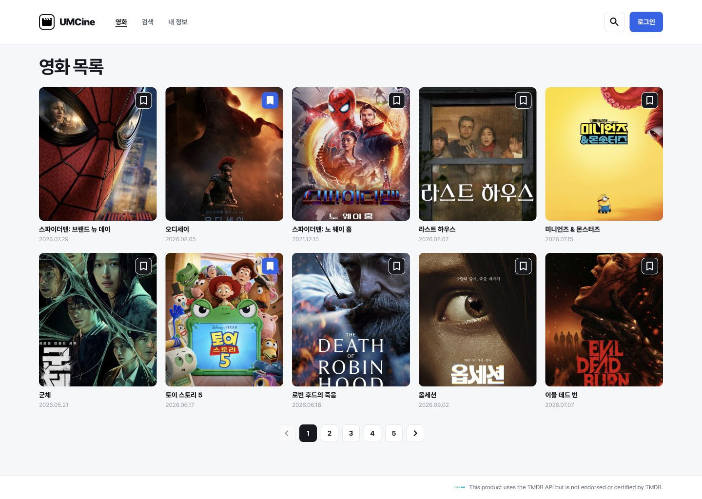
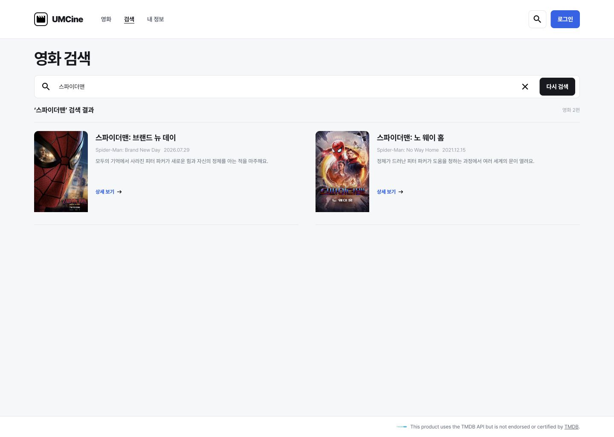
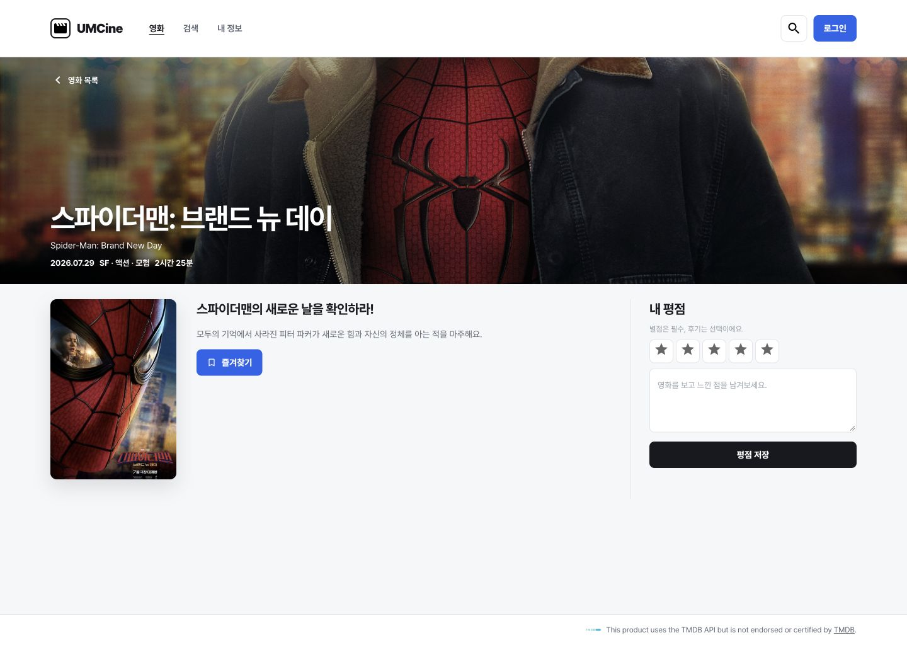

# 3주차 미션 기록

## 필수 미션

TanStack Router의 파일 기반 라우팅으로 목록(`/`), 검색(`/search?query=...`), 상세(`/movies/$movieId`)를 연결했습니다.
공통 레이아웃에는 Header·Footer·Outlet을 두고, route 파일은 URL 처리와 page 연결만 담당하도록 나눴습니다.

### 핵심 코드

검색어를 URL에 남기고 `validateSearch`로 검증합니다.

```tsx
export const Route = createFileRoute('/search')({
  validateSearch: validateMovieSearch,
  component: function SearchRoute() {
    const { query } = Route.useSearch();
    return <MovieSearchPage query={query} />;
  },
});

// 검색폼 제출 시
void navigate({ to: '/search', search: { query: input.trim() } });
```

영화 카드와 검색 결과는 `Link`로 상세 화면에 이동합니다.
상세 화면에서는 path param으로 로컬 데이터를 찾고, 잘못된 ID라면 안내를 표시합니다.

```tsx
<Link to="/movies/$movieId" params={{ movieId: String(movie.id) }}>
  {movie.title}
</Link>

const movie = findMovie(movies, movieId);
// movie가 없으면: 영화를 찾을 수 없어요.
```

기존 화면 CSS는 Tailwind class로 옮겼고, 상태에 따른 class는 `clsx`와 `tailwind-merge`를 사용하는 `cn`으로 합쳤습니다.

```tsx
className={cn(
  'border-white bg-ink',
  movie.isBookmarked && 'border-primary bg-primary',
)}
```

### 최종 확인 결과

- `/`에서 제공된 영화 10편과 포스터가 정상 표시됩니다.
- `스파이더맨`을 검색하면 결과 2편과 원제·개봉일·줄거리가 표시됩니다. 영문 제목은 대소문자를 구분하지 않습니다.
- 검색어가 없으면 검색 안내 화면, 일치하는 영화가 없으면 결과 없음 안내가 표시됩니다.
- `/movies/1` 직접 접속·새로고침에서도 해당 영화의 제목·이미지·장르·상영 시간·줄거리가 유지됩니다.
- `/movies/999`, `/movies/abc`에서 `영화를 찾을 수 없어요.`가 표시됩니다.
- 카드·검색 결과에서 상세로 이동하고 뒤로 가면 검색 URL과 결과가 유지됩니다.
- 목록에서 변경한 즐겨찾기가 상세에도 반영됩니다.
- 평점 미선택 시 안내가 표시되며, 선택 후 저장한 평점은 새로고침해도 유지됩니다.
- 데스크톱 화면을 Figma의 목록·검색·상세 프레임과 비교했습니다. 이미지·줄거리·결과 수는 로컬 데이터 기준입니다.
- 실제 빌드 화면의 브라우저 Console warning/error: 없음.
- `pnpm check`, `pnpm lint`, `pnpm build`: 통과. `pnpm test`: 15개 통과.

## 선택 미션

현재 경로를 읽어 목록·상세에서는 `영화`, 검색에서는 `검색` 메뉴만 활성화했습니다.
카드 그리드는 Tailwind의 반응형 class로 구성했습니다.

```tsx
className="grid grid-cols-1 min-[480px]:grid-cols-2 min-[700px]:grid-cols-3 min-[1100px]:grid-cols-5"
```

실제 브라우저 검증: 1440px 5열 / 900px 3열 / 600px 2열 / 390px 1열.
모바일의 목록·검색·상세 화면에서 가로 넘침 없이 표시되는 것을 확인했습니다.

## 트러블 슈팅

### 1. 검색 영역과 ARIA 접근성 오류

- 문제: 검사에서 `useSemanticElements`, `useAriaPropsSupportedByRole` 오류가 발생했습니다.
- 원인: `form role="search"`를 사용하고 일반 `span`에 지원되지 않는 `aria-label`을 붙였습니다.
- 해결: 검색폼을 의미 있는 `<search>` 요소 안에 배치하고, 일반 텍스트의 설명은 `title`로 옮겼습니다.
- 배운 점: ARIA를 임의로 붙이기보다 HTML의 의미에 맞는 요소를 먼저 사용해야 합니다.

### 2. route 파일의 Fast Refresh·Hook 오류

- 문제: `Fast refresh only works when a file only exports components` 오류가 발생했습니다.
  이를 정리하는 과정에서 익명 `component` 함수에 `Route.useSearch()`를 호출하자 `rules-of-hooks` 오류도 발생했습니다.
- 원인: route 설정과 외부로 export하지 않은 화면 함수를 같은 파일에 두었고, 익명 함수의 이름은 React 컴포넌트 규칙에 맞지 않았습니다.
- 해결: 공통 레이아웃을 별도 컴포넌트로 분리하고, route의 `component`는 `function SearchRoute()`처럼 대문자로 시작하는 함수 표현식으로 작성했습니다.
  route의 `Route` export만 린트에서 허용하고, 다른 파일의 Fast Refresh·Hook 검사는 유지했습니다.
- 배운 점: route는 URL 연결에 집중시키고 실제 화면은 page 컴포넌트로 나누는 구조가 관리와 검사에 유리합니다.

### 확인 사항

`tsr generate` 실행 시 Node에서 `replaceRouteChunk` 관련 순환 의존성 경고가 출력됩니다.
라우트 생성·타입 검사·빌드는 성공했고, 빌드 화면의 브라우저 Console에는 오류나 경고가 없었습니다.
이 CLI 경고를 숨기거나 의존성 내부 코드를 임의로 수정하지 않았습니다.

## 결과 화면

| 목록 · 데스크톱 | 목록 · 모바일 |
| --- | --- |
|  |  |




